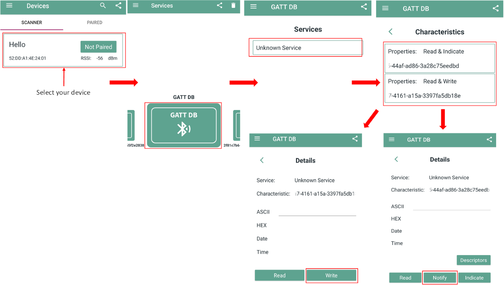
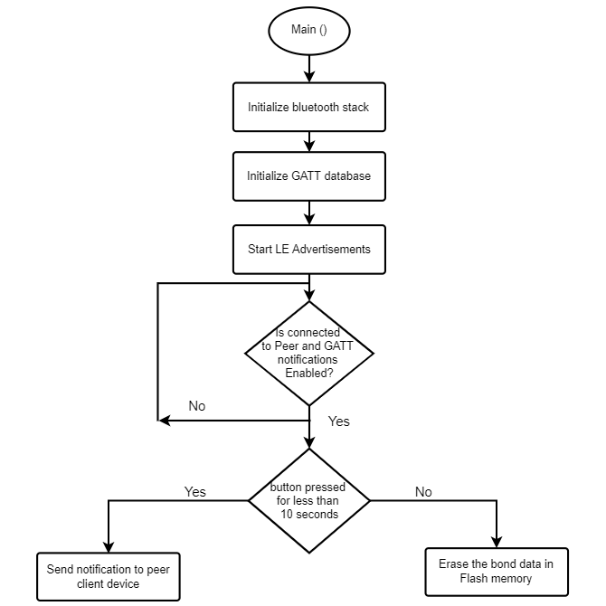

# BTSTACK: Bluetooth&reg; LE Hello Sensor

This code example demonstrates the implementation of a Bluetooth&reg; LE custom service with Bluetooth&reg; using AIROC&trade; CYW55xxx devices and ModusToolbox&trade; environment.

[View this README on GitHub.](https://github.com/Infineon/mtb-example-btstack-threadx-hello-sensor)

[Provide feedback on this code example.](https://cypress.co1.qualtrics.com/jfe/form/SV_1NTns53sK2yiljn?Q_EED=eyJVbmlxdWUgRG9jIElkIjoiQ0UyMzUxNTAiLCJTcGVjIE51bWJlciI6IjAwMi0zNTE1MCIsIkRvYyBUaXRsZSI6IkJUU1RBQ0s6IEJsdWV0b290aCZyZWc7IExFIEhlbGxvIFNlbnNvciIsInJpZCI6InRyaW5hZGggdW5kYXZhbGxpIiwiRG9jIHZlcnNpb24iOiIxLjAuMCIsIkRvYyBMYW5ndWFnZSI6IkVuZ2xpc2giLCJEb2MgRGl2aXNpb24iOiJNQ0QiLCJEb2MgQlUiOiJJQ1ciLCJEb2MgRmFtaWx5IjoiQlRBQkxFIn0=)

## Requirements

- [ModusToolbox&trade;](https://www.infineon.com/modustoolbox) v3.1 or later (tested with v3.1) with ModusToolbox&trade; CYW955513 Early Access Pack for CYW955513EVK-01
- Board support package (BSP) minimum required version: 0.6.0
- Programming language: C
- Associated parts: CYW955513EVK-01

## Supported toolchains (make variable 'TOOLCHAIN')

- GNU Arm&reg; Embedded Compiler v10.3.1 (`GCC_ARM`) – Default value of `TOOLCHAIN`

## Supported kits (make variable 'TARGET')

- CYW955513EVK-01 Wi-Fi Bluetooth&reg; Prototyping Kit (`CYW955513EVK-01`) – Default value of `TARGET`

## Hardware setup

This example uses the kit's default configuration. See the kit user guide to ensure that the kit is configured correctly.

> **Note:** The CYW955513EVK-01 Wi-Fi Bluetooth&reg; Prototyping Kit ships with KitProg3 version 2.30 installed. ModusToolbox&trade; requires KitProg3 with the latest version 2.50. Before using this code example, make sure that the board is upgraded to KitProg3 2.50. The tool and instructions are available in the [Firmware Loader](https://github.com/Infineon/Firmware-loader) GitHub repository. If you do not upgrade, you will see an error like "unable to find CMSIS-DAP device" or "KitProg firmware is out of date".

## Software setup

See the [ModusToolbox&trade; tools package installation guide](https://www.infineon.com/ModusToolboxInstallguide) for information about installing and configuring the tools package.

Download and install the AIROC&trade; Bluetooth&reg; Connect App for [iOS](https://apps.apple.com/in/app/airoc-bluetooth-connect-app/id6443702288) or [Android](https://play.google.com/store/apps/details?id=com.infineon.airocbluetoothconnect).

Scan the following QR codes from your mobile phone to download the AIROC&trade; Bluetooth&reg; Connect App.

**Figure 1.  QR codes for AIROC&trade; Bluetooth&reg; Connect App**


Install a terminal emulator if you don't have one. Instructions in this document use [Tera Term](https://teratermproject.github.io/index-en.html).


## Using the code example

### Create the project

The ModusToolbox&trade; tools package provides the Project Creator as both a GUI tool and a command line tool.

<details><summary><b>Use Project Creator GUI</b></summary>

1. Open the Project Creator GUI tool.

   There are several ways to do this, including launching it from the dashboard or from inside the Eclipse IDE. For more details, see the [Project Creator user guide](https://www.infineon.com/ModusToolboxProjectCreator) (locally available at *{ModusToolbox&trade; install directory}/tools_{version}/project-creator/docs/project-creator.pdf*).

2. On the **Choose Board Support Package (BSP)** page, select a kit supported by this code example. See [Supported kits](#supported-kits-make-variable-target).

   > **Note:** To use this code example for a kit not listed here, you may need to update the source files. If the kit does not have the required resources, the application may not work.

3. On the **Select Application** page:

   a. Select the **Applications(s) Root Path** and the **Target IDE**.

   > **Note:** Depending on how you open the Project Creator tool, these fields may be pre-selected for you.

   b.	Select this code example from the list by enabling its check box.

   > **Note:** You can narrow the list of displayed examples by typing in the filter box.

   c. (Optional) Change the suggested **New Application Name** and **New BSP Name**.

   d. Click **Create** to complete the application creation process.

</details>

<details><summary><b>Use Project Creator CLI</b></summary>

The 'project-creator-cli' tool can be used to create applications from a CLI terminal or from within batch files or shell scripts. This tool is available in the *{ModusToolbox&trade; install directory}/tools_{version}/project-creator/* directory.

Use a CLI terminal to invoke the 'project-creator-cli' tool. On Windows, use the command-line 'modus-shell' program provided in the ModusToolbox&trade; installation instead of a standard Windows command-line application. This shell provides access to all ModusToolbox&trade; tools. You can access it by typing "modus-shell" in the search box in the Windows menu. In Linux and macOS, you can use any terminal application.

The following example clones the "[mtb-example-btstack-threadx-hello-sensor](https://github.com/Infineon/mtb-example-btstack-threadx-hello-sensor)" application with the desired name "HelloSensor" configured for the *CYW955513EVK-01* BSP into the specified working directory, *C:/mtb_projects*:

   ```
   project-creator-cli --board-id CYW955513EVK-01 --app-id mtb-example-psoc6-hello-world --user-app-name HelloSensor --target-dir "C:/mtb_projects"
   ```


The 'project-creator-cli' tool has the following arguments:

Argument | Description | Required/optional
---------|-------------|-----------
`--board-id` | Defined in the <id> field of the [BSP](https://github.com/Infineon?q=bsp-manifest&type=&language=&sort=) manifest | Required
`--app-id`   | Defined in the <id> field of the [CE](https://github.com/Infineon?q=ce-manifest&type=&language=&sort=) manifest | Required
`--target-dir`| Specify the directory in which the application is to be created if you prefer not to use the default current working directory | Optional
`--user-app-name`| Specify the name of the application if you prefer to have a name other than the example's default name | Optional

> **Note:** The project-creator-cli tool uses the `git clone` and `make getlibs` commands to fetch the repository and import the required libraries. For details, see the "Project creator tools" section of the [ModusToolbox&trade; tools package user guide](https://www.infineon.com/ModusToolboxUserGuide) (locally available at {ModusToolbox&trade; install directory}/docs_{version}/mtb_user_guide.pdf).

</details>


### Open the project

After the project has been created, you can open it in your preferred development environment.


<details><summary><b>Eclipse IDE</b></summary>

If you opened the Project Creator tool from the included Eclipse IDE, the project will open in Eclipse automatically.

For more details, see the [Eclipse IDE for ModusToolbox&trade; user guide](https://www.infineon.com/MTBEclipseIDEUserGuide) (locally available at *{ModusToolbox&trade; install directory}/docs_{version}/mt_ide_user_guide.pdf*).

</details>


<details><summary><b>Visual Studio (VS) Code</b></summary>

Launch VS Code manually, and then open the generated *{project-name}.code-workspace* file located in the project directory.

For more details, see the [Visual Studio Code for ModusToolbox&trade; user guide](https://www.infineon.com/MTBVSCodeUserGuide) (locally available at *{ModusToolbox&trade; install directory}/docs_{version}/mt_vscode_user_guide.pdf*).

</details>


<details><summary><b>Command line</b></summary>

If you prefer to use the CLI, open the appropriate terminal, and navigate to the project directory. On Windows, use the command-line 'modus-shell' program; on Linux and macOS, you can use any terminal application. From there, you can run various `make` commands.

For more details, see the [ModusToolbox&trade; tools package user guide](https://www.infineon.com/ModusToolboxUserGuide) (locally available at *{ModusToolbox&trade; install directory}/docs_{version}/mtb_user_guide.pdf*).

</details>


## Steps to enable BTSpy logs

1. Navigate to the application Makefile and open it. Find the Makefile variable `ENABLE_SPY_TRACES` and set it to the value *1* as shown:
    ```
    ENABLE_SPY_TRACES = 1
    ```
2. Save the Makefile, and then build and program the application to the board.

3. Launch the [BTSpy](https://github.com/Infineon/btsdk-utils/tree/master/BTSpy) tool.

4. Open the [ClientControl](https://github.com/Infineon/btsdk-host-apps-bt-ble/tree/master/client_control) application and make the following settings:
   - Set the baud rate to 3000000.
   - Deselect flow control.
   - Select the serial port and click on an open port.

## Operation
1. Connect the board to your PC using the provided USB cable through the KitProg3 USB connector.

2. Start the ClientControl and BTSpy applications using the steps from the section above, but do not open any serial port.

3. Program the board using one of the following:

   <details><summary><b>Using Eclipse IDE</b></summary>

      1. Select the application project in the Project Explorer.

      2. In the **Quick Panel**, scroll down, and click **\<Application Name> Program (KitProg3_MiniProg4)**.
   </details>


   <details><summary><b>In other IDEs</b></summary>

   Follow the instructions in your preferred IDE.
   </details>


   <details><summary><b>Using CLI</b></summary>

     From the terminal, execute the `make program` command to build and program the application using the default toolchain to the default target. The default toolchain is specified in the application's Makefile but you can override this value manually:
      ```
      make program TOOLCHAIN=<toolchain>
      ```

      Example:
      ```
      make program TOOLCHAIN=GCC_ARM
      ```
   </details>

4. After programming, the application starts automatically. Open the serial port using the ClientControl application to observe the messages/HCI traces on the BTSpy application. Wait for the device to connect with the peer client (for example, the AIROC&trade; Bluetooth&reg; Connect App). Use the BTSpy to view the Bluetooth&reg; stack and application trace messages in the terminal window.

5. To test using a Hello Client peer application, follow these steps:

   - Ensure that you have programmed Hello Client to another supported BSP and the application is advertising with the name **Hello Client**.

   - Press the user button on Hello Client to start scanning for the Hello Sensor and connect to it automatically.

   - Press the user button and connect with more Hello Sensor devices, one at a time. The Hello Client application is capable of connecting up to three Hello Sensors.

   - After Hello Client is connected to at least one Hello Sensor it starts advertisement by default if button press is not detected. Using smart phone installed with AIROC&trade; Bluetooth&reg; Connect App; scan for **Hello Client** and issue connection from the phone.

   - After connection and service discovery is complete, you will see three GATT Services. Each service corresponds to Hello Sensors connected to the Hello Client. You can issue 'Read' from AIROC&trade; Bluetooth&reg; Connect App to the Device Name Characteristic of first service to know the device name of the first Hello Sensor connected. You can use the Device Name Characteristic to identify rest of the Hello Sensors connected.

   - Go to Notify Characteristic of a connected Hello Sensor. Click **Read** or **Start Notify** button. This triggers pairing when the phone and Hello Client are not bonded. Accept the pairing request on the phone.

   - You will receive notification from the Hello Sensor through Hello Client to the phone. Press button on the first Hello Sensor and observe the corresponding Notify Characteristic on the phone to get the notification.

6. To test using the AIROC&trade; Bluetooth&reg; Connect App, do the following:

   - Turn on Bluetooth&reg; on your Android or iOS device.

   - Launch the AIROC&trade; Bluetooth&reg; Connect App.

   

   **Figure 2. Testing with the AIROC&trade; Bluetooth&reg; Connect App on Android**

   - Swipe down on the AIROC&trade; Bluetooth&reg; Connect App home screen to start scanning for Bluetooth&reg; LE peripherals; your device ("Hello") appears on the AIROC&trade; Bluetooth&reg; Connect App home screen. Select your device to establish a Bluetooth&reg; LE connection.

   - In the Services page, choose the first characteristic to enable notifications/indications. Register for notifications or indications. This initiates the pairing process.

   - Press the user button 1 in the kit and observe that notification/indication is being received in the mobile app.

   - You can use the Write Characteristic to blink the LED on the Hello Sensor through phone. Choose the Write Characteristic from first service and write a value from 1 - 9 to blink LED on the first Hello Sensor.

7. To forget a bonded device, reset the device.

## Debugging

You can debug the example to step through the code.


<details><summary><b>In Eclipse IDE</b></summary>

Use the **\<Application Name> Debug (KitProg3_MiniProg4)** configuration in the **Quick Panel**. For details, see the "Program and debug" section in the [Eclipse IDE for ModusToolbox&trade; user guide](https://www.infineon.com/MTBEclipseIDEUserGuide).

> **Note:** **(Only while debugging)** On the CM4 CPU, some code in `main()` may execute before the debugger halts at the beginning of `main()`. This means that some code executes twice – once before the debugger stops execution, and again after the debugger resets the program counter to the beginning of `main()`. See [KBA231071](https://community.infineon.com/docs/DOC-21143) to learn about this and for the workaround.

</details>


<details><summary><b>In other IDEs</b></summary>

Follow the instructions in your preferred IDE.

</details>


> **Note:** Debugging is of limited value when there is an active Bluetooth&reg; LE connection because as soon as the Bluetooth&reg; LE device stops responding, the connection will get dropped.

## Design and implementation

The code example configures the device as a Bluetooth&reg; LE GAP Peripheral and GATT Server. The example implements a custom GATT service called 'Hello_Sensor' service and has two custom characteristics - Notify and Blink. The Notify Characteristic sends a notification or indication to the peer client device upon button press events. The Blink Characteristic is used by the peer client to write the number of times the onboard user LED should blink.

After reset, the application starts automatically and initializes BTSTACK and other device peripherals. The device starts to advertise its presence to the peer central devices. Aftere a Bluetooth&reg; LE connection is established, the peer client device can register for notifications/indications to be received using the CCCD handle of the Notify Characteristic. Because the CCCD handle of the Notify characteristic requires write authentication, an attempt to enable notification/indication will trigger the pairing process at the Central side. Once the pairing process completes, the peer device's link keys and addresses are stored in the device's flash memory and they are bonded.

The user button on the board is configured to trigger an interrupt on the falling edge. Press and release the button quickly to start undirected high advertisements if no connection exists. If a connection exists and notifications/indications are enabled, sends a notification/indication packet to the peer client device.

The peer client can also write the number of times the user LED on the board blinks using the Blink Characteristic.



**Figure 3.  Hello Sensor process flowchart**

## Notes

On the CYW955513EVK-01 boards no flash memory is present. So, all the bonding information along with the downloaded application is lost. After a board reset; application needs to be downloaded again for the board to operational as well as repairing is required with peer devices.

## Resources and settings

This section explains the ModusToolbox&trade; resources and their configurations used in this code example. Note that all the configurations explained in this section have already been implemented in the code example.

- **Device Configurator:** ModusToolbox&trade; stores the configuration settings of the application in the *design.modus* file. This file is used by the Device Configurator that generates the configuration firmware. This firmware is stored in the application's *GeneratedSource* folder.

   By default, all applications in a workspace share the same *design.modus* file i.e., they share the same pin configuration. Each BSP has a default *design.modus* file in the *mtb_shared\TARGET_\<bsp name\>\<version\>\COMPONENT_BSP_DESIGN_MODUS* directory. It is not recommended to modify the configuration of a standard BSP directly.

   To modify the configuration for a single application or to create a custom BSP, see the [ModusToolbox&trade; user guide](https://www.infineon.com/MTBEclipseIDEUserguide). This example uses the default configuration. See the [ModusToolbox&trade; Device Configurator user guide](https://www.infineon.com/ModusToolboxDeviceConfig).

- **Bluetooth&reg; Configurator:** The Bluetooth&reg; peripheral has an additional configurator called the "Bluetooth&reg; Configurator" that is used to generate the Bluetooth&reg; LE GATT database and various Bluetooth&reg; settings for the application. These settings are stored in the file named *design.cybt*.

   Note that unlike the Device Configurator, the Bluetooth&reg; Configurator settings and files are local to each respective application. The services and characteristics added are explained in the [Design and implementation](#design-and-implementation) section. See the [Bluetooth&reg; Configurator user guide](https://www.infineon.com/ModusToolboxBLEConfig).

<br>


## Related resources


Resources  | Links
-----------|----------------------------------
Code examples  | [Using ModusToolbox&trade;](https://github.com/Infineon/Code-Examples-for-ModusToolbox-Software) on GitHub
Development kits | Select your kits from the [Evaluation board finder](https://www.infineon.com/cms/en/design-support/finder-selection-tools/product-finder/evaluation-board).
Tools  | [ModusToolbox&trade;](https://www.infineon.com/modustoolbox) – ModusToolbox&trade; software is a collection of easy-to-use libraries and tools enabling rapid development with Infineon MCUs for applications ranging from wireless and cloud-connected systems, edge AI/ML, embedded sense and control, to wired USB connectivity using PSoC&trade; Industrial/IoT MCUs, AIROC&trade; Wi-Fi and Bluetooth&reg; connectivity devices, XMC&trade; Industrial MCUs, and EZ-USB&trade;/EZ-PD&trade; wired connectivity controllers. ModusToolbox&trade; incorporates a comprehensive set of BSPs, HAL, libraries, configuration tools, and provides support for industry-standard IDEs to fast-track your embedded application development.

<br>


## Other resources


Infineon provides a wealth of data at [www.infineon.com](https://www.infineon.com) to help you select the right device, and quickly and effectively integrate it into your design.


## Document history

Document title: *CE235150* – *Bluetooth&reg; LE Hello Sensor*

 Version | Description of change
 ------- | ---------------------
 1.0.0   | New code example
 <br>


All referenced product or service names and trademarks are the property of their respective owners.

The Bluetooth&reg; word mark and logos are registered trademarks owned by Bluetooth SIG, Inc., and any use of such marks by Infineon is under license.


---------------------------------------------------------

© Cypress Semiconductor Corporation, 2023. This document is the property of Cypress Semiconductor Corporation, an Infineon Technologies company, and its affiliates ("Cypress").  This document, including any software or firmware included or referenced in this document ("Software"), is owned by Cypress under the intellectual property laws and treaties of the United States and other countries worldwide.  Cypress reserves all rights under such laws and treaties and does not, except as specifically stated in this paragraph, grant any license under its patents, copyrights, trademarks, or other intellectual property rights.  If the Software is not accompanied by a license agreement and you do not otherwise have a written agreement with Cypress governing the use of the Software, then Cypress hereby grants you a personal, non-exclusive, nontransferable license (without the right to sublicense) (1) under its copyright rights in the Software (a) for Software provided in source code form, to modify and reproduce the Software solely for use with Cypress hardware products, only internally within your organization, and (b) to distribute the Software in binary code form externally to end users (either directly or indirectly through resellers and distributors), solely for use on Cypress hardware product units, and (2) under those claims of Cypress's patents that are infringed by the Software (as provided by Cypress, unmodified) to make, use, distribute, and import the Software solely for use with Cypress hardware products.  Any other use, reproduction, modification, translation, or compilation of the Software is prohibited.
<br>
TO THE EXTENT PERMITTED BY APPLICABLE LAW, CYPRESS MAKES NO WARRANTY OF ANY KIND, EXPRESS OR IMPLIED, WITH REGARD TO THIS DOCUMENT OR ANY SOFTWARE OR ACCOMPANYING HARDWARE, INCLUDING, BUT NOT LIMITED TO, THE IMPLIED WARRANTIES OF MERCHANTABILITY AND FITNESS FOR A PARTICULAR PURPOSE.  No computing device can be absolutely secure.  Therefore, despite security measures implemented in Cypress hardware or software products, Cypress shall have no liability arising out of any security breach, such as unauthorized access to or use of a Cypress product. CYPRESS DOES NOT REPRESENT, WARRANT, OR GUARANTEE THAT CYPRESS PRODUCTS, OR SYSTEMS CREATED USING CYPRESS PRODUCTS, WILL BE FREE FROM CORRUPTION, ATTACK, VIRUSES, INTERFERENCE, HACKING, DATA LOSS OR THEFT, OR OTHER SECURITY INTRUSION (collectively, "Security Breach").  Cypress disclaims any liability relating to any Security Breach, and you shall and hereby do release Cypress from any claim, damage, or other liability arising from any Security Breach.  In addition, the products described in these materials may contain design defects or errors known as errata which may cause the product to deviate from published specifications. To the extent permitted by applicable law, Cypress reserves the right to make changes to this document without further notice. Cypress does not assume any liability arising out of the application or use of any product or circuit described in this document. Any information provided in this document, including any sample design information or programming code, is provided only for reference purposes.  It is the responsibility of the user of this document to properly design, program, and test the functionality and safety of any application made of this information and any resulting product.  "High-Risk Device" means any device or system whose failure could cause personal injury, death, or property damage.  Examples of High-Risk Devices are weapons, nuclear installations, surgical implants, and other medical devices.  "Critical Component" means any component of a High-Risk Device whose failure to perform can be reasonably expected to cause, directly or indirectly, the failure of the High-Risk Device, or to affect its safety or effectiveness.  Cypress is not liable, in whole or in part, and you shall and hereby do release Cypress from any claim, damage, or other liability arising from any use of a Cypress product as a Critical Component in a High-Risk Device. You shall indemnify and hold Cypress, including its affiliates, and its directors, officers, employees, agents, distributors, and assigns harmless from and against all claims, costs, damages, and expenses, arising out of any claim, including claims for product liability, personal injury or death, or property damage arising from any use of a Cypress product as a Critical Component in a High-Risk Device. Cypress products are not intended or authorized for use as a Critical Component in any High-Risk Device except to the limited extent that (i) Cypress's published data sheet for the product explicitly states Cypress has qualified the product for use in a specific High-Risk Device, or (ii) Cypress has given you advance written authorization to use the product as a Critical Component in the specific High-Risk Device and you have signed a separate indemnification agreement.
<br>
Cypress, the Cypress logo, and combinations thereof, ModusToolbox, PSoC, CAPSENSE, EZ-USB, F-RAM, and TRAVEO are trademarks or registered trademarks of Cypress or a subsidiary of Cypress in the United States or in other countries. For a more complete list of Cypress trademarks, visit www.infineon.com. Other names and brands may be claimed as property of their respective owners.
